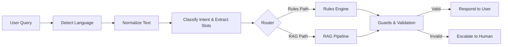
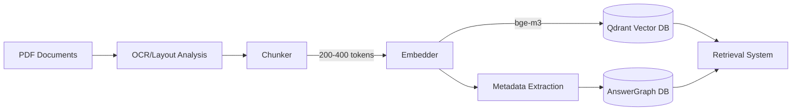
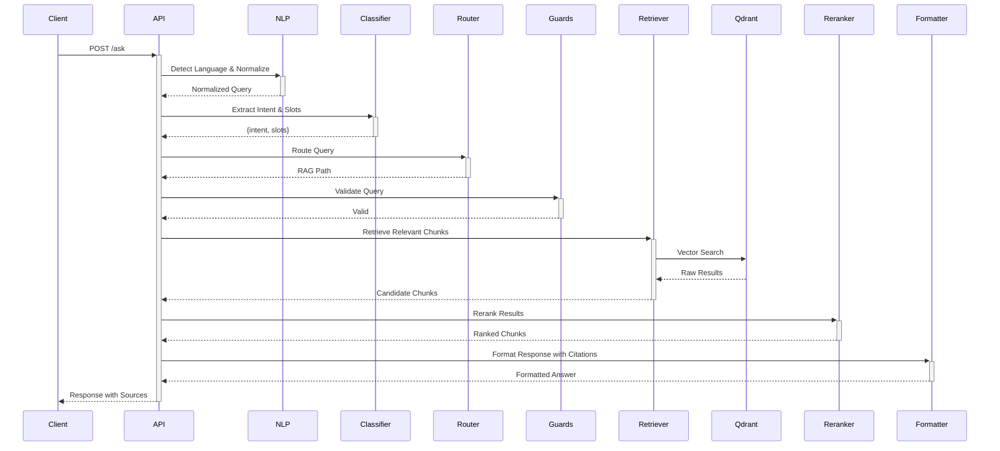
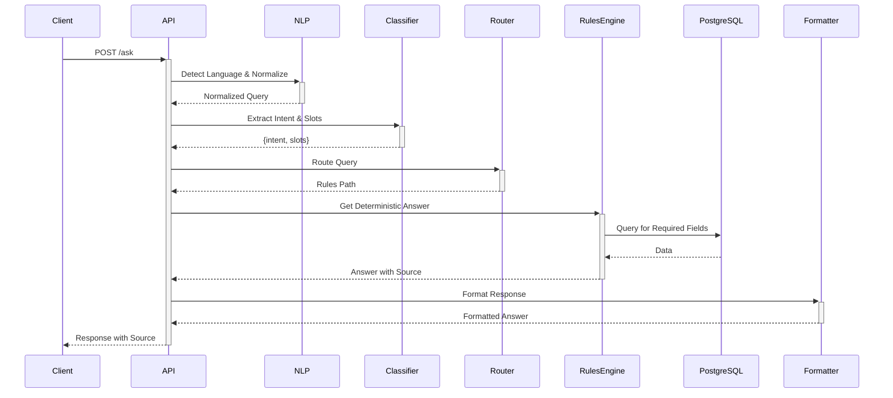

# A2G Backend Architecture

## 1. System Overview

A2G (Ask to Governance) is a Retrieval-Augmented Generation (RAG) system for governance documents. It combines rule-based and vector-based retrieval to provide accurate, sourced answers to policy questions.

### High-Level Runtime Flow

## 2. Data Ingestion Pipeline

The ingestion pipeline processes documents and makes them retrievable:

### Key Processing Steps:
- **PDF Processing**: Extract text while preserving layout
- **Chunking**: 200-400 token chunks with optimal semantic boundaries
- **Embedding**: Using bge-m3 embedding model for high-quality semantic representations
- **Storage**:
  - Vector embeddings in Qdrant
  - Metadata and relationships in PostgreSQL

## 3. Core Components

### Singleton Resources
- **QdrantClient**: Vector database client for semantic search
- **SentenceTransformer**: Embedding model for converting text to vectors
- **CrossEncoder**: Reranking model for improving retrieval precision
- **DB Session**: PostgreSQL database session factory

### Key Modules
- **Language Processing** (`src/nlp/`):
  - Language detection
  - Text normalization
  - Machine translation
- **Intent Classification** (`src/classifier/`):
  - Query intent detection
  - Slot filling
- **RAG Pipeline** (`src/rag/`):
  - Retriever
  - Reranker
  - Router
  - Guards
- **Rules Engine** (`src/answers/`):
  - Deterministic responses for structured queries
- **Admin Tools** (`src/api/admin_routes.py`):
  - System management endpoints
  - Policy reloading

## 4. API Surface

| Endpoint | Method | Description | Authentication |
|----------|--------|-------------|----------------|
| `/api/v1/ask` | POST | Primary query endpoint | None |
| `/api/v1/health` | GET | Health check endpoint | None |
| `/api/v1/admin/reload` | POST | Reload and reindex a policy | API Key |
| `/api/v1/admin/changes` | GET | List recent policy changes | API Key |

## 5. Sequence Diagrams

### RAG Path Flow

### Rules Path Flow

## 6. Non-Functional Requirements

### Performance
- **p95 Latency**: ≤ 2 seconds for complete query processing
- **Availability**: 99.9% uptime during business hours

### Quality
- **Citation Rate**: 100% of answers must include source citations
- **First Call Resolution**: Target >80% of queries resolved on first attempt

### Security & Compliance
- **Admin Access**: API key authentication for administrative endpoints
- **Logging**: 30-day retention of all system logs
- **Auditing**: All policy changes tracked with timestamps

### Scalability
- **Concurrent Users**: Support for 100+ simultaneous users
- **Document Volume**: Handle 10,000+ policy documents
